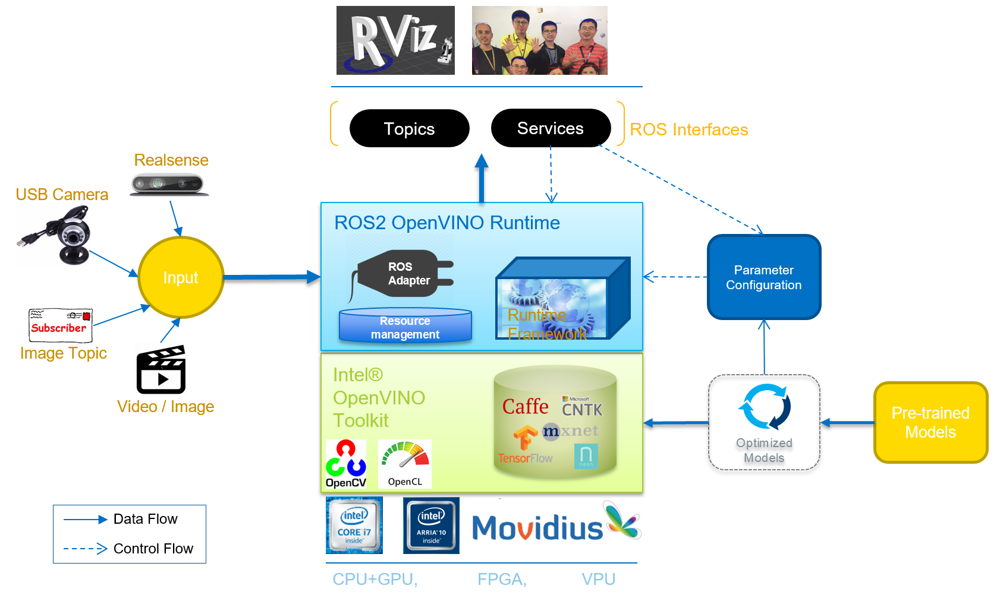
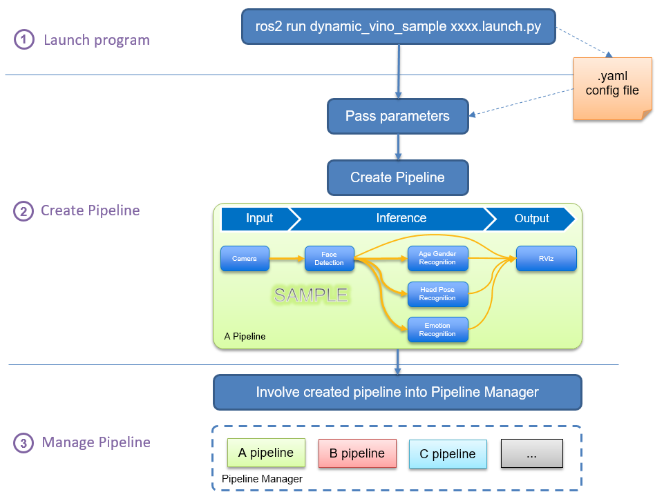
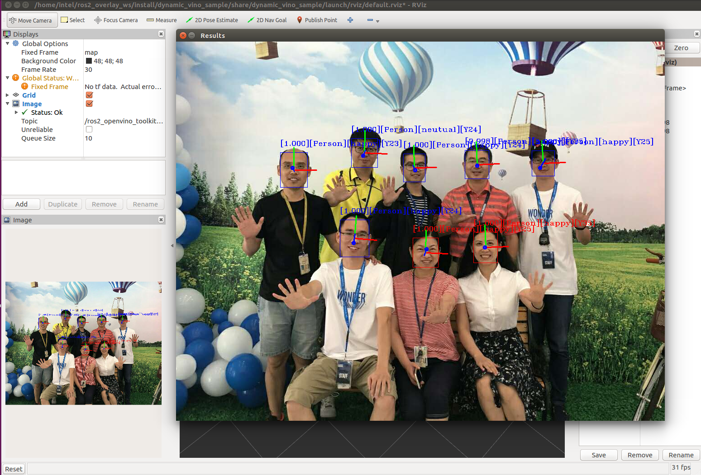

# ros2_openvino_toolkit

# Table of Contents
* [➤ Overview](#overview)
	* [ROS2 Version Supported](#ros2-version-supported)
	* [Inference Features Supported](#inference-features-supported)
* [➤ Prerequisite](#prerequisite)	
* [➤ Introduction](#introduction)
	* [Design Architecture](#design-architecture)
	* [Logic Flow](#logic-flow)
* [➤ Supported Features](#supported-features)
	* [Multiple Input Components](#multiple-input-components)
	* [Inference Implementations](#inference-implementations)
	* [ROS Interfaces and Outputs](#ros-interfaces-and-outputs)
	* [Demo Result Snapshots](#demo-result-snapshots)
* [➤ Installation & Launching](#installation-and-launching)
	* [Deploy in Local Environment](#deploy-in-local-environment)
	* [Deploy in Docker](#deploy-in-docker)
* [➤ Reference](#reference)
* [➤ FAQ](#faq)
* [➤ Feedback](#feedback)
* [➤ More Information](#more-information)

# Overview
## ROS2 Version Supported

|Branch Name|ROS2 Version Supported|Openvino Version|OS Version|
|-----------------------|-----------------------|--------------------------------|----------------------|
|[ros2](https://github.com/intel/ros2_openvino_toolkit/tree/ros2)|Galactic, Foxy, Humble|V2022.1, V2022.2, V2022.3|Ubuntu 20.04, Ubuntu 22.04|
|[dashing](https://github.com/intel/ros2_openvino_toolkit/tree/dashing)|Dashing|V2022.1, V2022.2, V2022.3|Ubuntu 18.04|
|[foxy-ov2021.4](https://github.com/intel/ros2_openvino_toolkit/tree/foxy)|Foxy|V2021.4|Ubuntu 20.04|
|[galactic-ov2021.4](https://github.com/intel/ros2_openvino_toolkit/tree/galactic-ov2021.4)|Galactic|V2021.4|Ubuntu 20.04|

## Inference Features Supported
* [x] Object Detection
* [x] Face Detection
* [x] Age Gender Recognition
* [x] Emotion Recognition
* [x] Head Pose Estimation
* [x] Object Segmentation
* [x] Person Re-Identification
* [x] Vehicle Attribute Detection
* [x] Vehicle License Plate Detection

# Prerequisite

|Prerequisite|Mandatory?|Description|
|-----------------------|-----------------------|--------------------------------|
|**Processor**|Mandatory|A platform with Intel processors assembled. (Refer to [here](https://software.intel.com/content/www/us/en/develop/articles/openvino-2020-3-lts-relnotes.html) for the full list of Intel processors supported.)|
|**OS**|Mandatory|We only tested this project under Ubuntu distros. It is recommended to install the corresponding Ubuntu Distro according to the ROS distro that you select to use. **For example: Ubuntu 18.04 for dashing, Ubuntu 20.04 for Foxy and Galactic, Ubuntu 22.04 for Humble.**|
|**ROS2**|Mandatory|We have already supported active ROS distros (Humble, Galactic, Foxy and Dashing (deprecated)). Choose the one matching your needs. You may find the corresponding branch from the table above in section [**ROS2 Version Supported**](#ros2-version-supported).|
|**OpenVINO**|Mandatory|The version of OpenVINO toolkit is decided by the OS and ROS2 distros you use. See the table above in Section [**ROS2 Version Supported**](#ros2-version-supported).|
|**Realsense Camera**|Optional|Realsense Camera is optional, you may choose these alternatives as the input: Standard Camera, ROS Image Topic, Video/Image File or RTSP camera.|

# Introduction
## Design Architecture
From the view of hierarchical architecture design, the package is divided into different functional components, as shown in below picture. 



<p>
<details>
<summary>Intel® OpenVINO™ toolkit</summary>

- **Intel® OpenVINO™ toolkit** provides a ROS-adapted runtime framework of neural network which quickly deploys applications and solutions for vision inference. By leveraging Intel® OpenVINO™ toolkit and corresponding libraries, this ROS2 runtime framework extends workloads across Intel® hardware (including accelerators) and maximizes performance.
   - Increase deep learning workload performance up to 19x1 with computer vision accelerators from Intel.
   - Unleash convolutional neural network (CNN)-based deep learning inference using a common API.
   - Speed development using optimized OpenCV* and OpenVX* functions.
See more from [here](https://github.com/openvinotoolkit/openvino) for Intel OpenVINO™ introduction.
</details>
</p>

<p>
<details>
<summary>ROS OpenVINO Runtime Framework</summary>

- **ROS OpenVINO Runtime Framework** is the main body of this repo. It provides key logic implementation for pipeline lifecycle management, resource management and ROS system adapter, which extends Intel OpenVINO toolkit and libraries. Furthermore, this runtime framework provides ways to simplify launching, configuration, data analysis and re-use.
</details>
</p>

<p>
<details>
<summary>ROS Input & Output</summary>

- **Diversal Input resources** are data resources to be inferred and analyzed with the OpenVINO framework.
- **ROS interfaces and outputs** currently include _Topic_ and _service_. Natively, RViz output and CV image window output are also supported by refactoring topic message and inference results.
</details>
</p>

<p>
<details>
<summary>Optimized Models</summary>

- **Optimized Models** provided by Model Optimizer component of Intel® OpenVINO™ toolkit. Imports trained models from various frameworks (Caffe*, Tensorflow*, MxNet*, ONNX*, Kaldi*) and converts them to a unified intermediate representation file. It also optimizes topologies through node merging, horizontal fusion, eliminating batch normalization, and quantization. It also supports graph freeze and graph summarize along with dynamic input freezing.
</details>
</p>

## Logic Flow
From the view of logic implementation, the package introduces the definitions of parameter manager, pipeline and pipeline manager. The following picture depicts how these entities co-work together when the corresponding program is launched.



Once a corresponding program is launched with a specified .yaml config file passed in the .launch file or via commandline, _**parameter manager**_ analyzes the configurations about pipeline and the whole framework, then shares the parsed configuration information with pipeline procedure. A _**pipeline instance**_ is created by following the configuration info and is added into _**pipeline manager**_ for lifecycle control and inference action triggering.

The contents in **.yaml config file** should be well structured and follow the supported rules and entity names. Please see [yaml configuration guidance](./doc/quick_start/yaml_configuration_guide.md) for how to create or edit the config files.

<p>
<details>
<summary>Pipeline</summary>

**Pipeline** fulfills the whole data handling process: initializing Input Component for image data gathering and formatting; building up the structured inference network and passing the formatted data through the inference network; transferring the inference results and handling output, etc.
</details>
</p>

<p>
<details>
<summary>Pipeline manager</summary>

**Pipeline manager** manages all the created pipelines according to the inference requests or external demands (say, system exception, resource limitation, or end user's operation). Because of co-working with resource management and being aware of the whole framework, it covers the ability of performance optimization by sharing system resource between pipelines and reducing the burden of data copy.
</details>
</p>

# Supported Features
## Multiple Input Components
Currently, the package supports several input resources for acquiring image data. The following tables are listed:

<p>
<details>
<summary>Input Resource Table</summary>

|Input Resource|Description|
|--------------------|------------------------------------------------------------------|
|StandardCamera|Any RGB camera with USB port supporting. Currently only the first USB camera if many are connected.|
|RealSenseCamera| Intel RealSense RGB-D Camera, directly calling RealSense Camera via librealsense plugin of openCV.|
|ImageTopic| Any ROS topic which is structured in image message.|
|Image| Any image file which can be parsed by openCV, such as .png, .jpeg.|
|Video| Any video file which can be parsed by openCV.|
|IpCamera| Any RTSP server which can push video stream.|
</details>
</p>

## Inference Implementations
Currently, the corresponding relation of supported inference features, models used and yaml configurations are listed as follows:

<p>
<details>
<summary>Inference Feature Correspondence Table</summary>

|Inference|Description|YAML Configuration|Model Used|
|-----------------------|------------------------------------------------------------------|----------------------|----------------------|
|Face Detection| Object Detection task applied to face recognition using a sequence of neural networks.|[pipeline_image.yaml](./sample/param/pipeline_image.yaml)<br>[pipeline_image_video.yaml](./sample/param/pipeline_image_video.yaml)<br>[pipeline_people.yaml](./sample/param/pipeline_people.yaml)<br>[pipeline_people_ip.yaml](./sample/param/pipeline_people_ip.yaml)|[face-detection-adas-0001](https://github.com/openvinotoolkit/open_model_zoo/tree/releases/2022/3/models/intel/face-detection-adas-0001)<br>[age-gender-recognition-retail-0013](https://github.com/openvinotoolkit/open_model_zoo/tree/releases/2022/3/models/intel/age-gender-recognition-retail-0013)<br>[emotions-recognition-retail-0003](https://github.com/openvinotoolkit/open_model_zoo/tree/releases/2022/3/models/intel/emotions-recognition-retail-0003)<br>[head-pose-estimation-adas-0001](https://github.com/openvinotoolkit/open_model_zoo/tree/releases/2022/3/models/intel/head-pose-estimation-adas-0001)|
|Emotion Recognition| Emotion recognition based on detected face image.|[pipeline_image.yaml](./sample/param/pipeline_image.yaml)<br>[pipeline_image_video.yaml](./sample/param/pipeline_image_video.yaml)<br>[pipeline_people.yaml](./sample/param/pipeline_people.yaml)<br>[pipeline_people_ip.yaml](./sample/param/pipeline_people_ip.yaml)|[emotions-recognition-retail-0003](https://github.com/openvinotoolkit/open_model_zoo/tree/releases/2022/3/models/intel/emotions-recognition-retail-0003)|
|Age & Gender Recognition| Age and gender recognition based on detected face image.|[pipeline_image.yaml](./sample/param/pipeline_image.yaml)<br>[pipeline_image_video.yaml](./sample/param/pipeline_image_video.yaml)<br>[pipeline_people.yaml](./sample/param/pipeline_people.yaml)<br>[pipeline_people_ip.yaml](./sample/param/pipeline_people_ip.yaml)|[age-gender-recognition-retail-0013](https://github.com/openvinotoolkit/open_model_zoo/tree/releases/2022/3/models/intel/age-gender-recognition-retail-0013)|
|Head Pose Estimation| Head pose estimation based on detected face image.|[pipeline_image.yaml](./sample/param/pipeline_image.yaml)<br>[pipeline_image_video.yaml](./sample/param/pipeline_image_video.yaml)<br>[pipeline_people.yaml](./sample/param/pipeline_people.yaml)<br>[pipeline_people_ip.yaml](./sample/param/pipeline_people_ip.yaml)|[head-pose-estimation-adas-0001](https://github.com/openvinotoolkit/open_model_zoo/tree/releases/2022/3/models/intel/head-pose-estimation-adas-0001)|
|Object Detection| Object detection based on SSD-based trained models.|[pipeline_object.yaml](./sample/param/pipeline_object.yaml)<br>[pipeline_object_topic.yaml](./sample/param/pipeline_object_topic.yaml)|[mobilenet-ssd](https://github.com/openvinotoolkit/open_model_zoo/tree/releases/2022/3/models/public/mobilenet-ssd)|
|Vehicle and License Detection| Vehicle and license detection based on Intel models.|[pipeline_vehicle_detection.yaml](./sample/param/pipeline_vehicle_detection.yaml)|[vehicle-license-plate-detection-barrier-0106](https://github.com/openvinotoolkit/open_model_zoo/tree/releases/2022/3/models/intel/vehicle-license-plate-detection-barrier-0106)<br>[vehicle-attributes-recognition-barrier-0039](https://github.com/openvinotoolkit/open_model_zoo/tree/releases/2022/3/models/intel/vehicle-attributes-recognition-barrier-0039)<br>[license-plate-recognition-barrier-0001](https://github.com/openvinotoolkit/open_model_zoo/tree/releases/2022/3/models/intel/license-plate-recognition-barrier-0001)|
|Object Segmentation| Object segmentation.|[pipeline_segmentation.yaml](./sample/param/pipeline_segmentation.yaml)<br>[pipeline_segmentation_image.yaml](./sample/param/pipeline_segmentation_image.yaml)<br>[pipeline_video.yaml](./sample/param/pipeline_video.yaml)|[semantic-segmentation-adas-0001](https://github.com/openvinotoolkit/open_model_zoo/tree/releases/2022/3/models/intel/semantic-segmentation-adas-0001)<br>[deeplabv3](https://github.com/openvinotoolkit/open_model_zoo/tree/releases/2022/3/models/public/deeplabv3)|
|Person Attributes| Person attributes based on object detection.|[pipeline_person_attributes.yaml](./sample/param/pipeline_person_attributes.yaml)|[person-attributes-recognition-crossroad-0230](https://github.com/openvinotoolkit/open_model_zoo/tree/releases/2022/3/models/intel/person-attributes-recognition-crossroad-0230)<br>[person-detection-retail-0013](https://github.com/openvinotoolkit/open_model_zoo/tree/releases/2022/3/models/intel/person-detection-retail-0013)|
|Person Reidentification|Person reidentification based on object detection.|[pipeline_person_reidentification.yaml](./sample/param/pipeline_reidentification.yaml)|[person-detection-retail-0013](https://github.com/openvinotoolkit/open_model_zoo/tree/releases/2022/3/models/intel/person-detection-retail-0013)<br>[person-reidentification-retail-0277](https://github.com/openvinotoolkit/open_model_zoo/tree/releases/2022/3/models/intel/person-reidentification-retail-0277)|
|Object Segmentation Maskrcnn| Object segmentation and detection based on maskrcnn model.|[pipeline_segmentation_maskrcnn.yaml](./sample/param/pipeline_segmentation_maskrcnn.yaml)|[mask_rcnn_inception_v2_coco_2018_01_28](https://github.com/openvinotoolkit/open_model_zoo/tree/releases/2022/3/models/public/mask_rcnn_inception_resnet_v2_atrous_coco)|
</details>
</p>

## ROS interfaces and outputs
The inference results can be output in several types. One or more types can be enabled for any inference pipeline.
### Topic
Specific topic(s) can be generated and published according to the given inference functionalities.

<p>
<details>
<summary>Published Topic Correspondence Table</summary>

|Inference|Published Topic|
|---|---|
|People Detection|```/ros2_openvino_toolkit/face_detection```([object_msgs:msg:ObjectsInBoxes](https://github.com/intel/ros2_object_msgs/blob/master/msg/ObjectsInBoxes.msg))|
|Emotion Recognition|```/ros2_openvino_toolkit/emotions_recognition```([object_msgs:msg:EmotionsStamped](../../../object_msgs/msg/EmotionsStamped.msg))|
|Age and Gender Recognition|```/ros2_openvino_toolkit/age_genders_Recognition```([object_msgs:msg:AgeGenderStamped](../../../object_msgs/msg/AgeGenderStamped.msg))|
|Head Pose Estimation|```/ros2_openvino_toolkit/headposes_estimation```([object_msgs:msg:HeadPoseStamped](../../../object_msgs/msg/HeadPoseStamped.msg))|
|Object Detection|```/ros2_openvino_toolkit/detected_objects```([object_msgs::msg::ObjectsInBoxes](https://github.com/intel/ros2_object_msgs/blob/master/msg/ObjectsInBoxes.msg))|
|Object Segmentation|```/ros2_openvino_toolkit/segmented_obejcts```([object_msgs::msg::ObjectsInMasks](../../../object_msgs/msg/ObjectsInMasks.msg))|
|Object Segmentation Maskrcnn|```/ros2_openvino_toolkit/segmented_obejcts```([object_msgs::msg::ObjectsInMasks](../../../object_msgs/msg/ObjectsInMasks.msg))|
|Person Reidentification|```/ros2_openvino_toolkit/reidentified_persons```([object_msgs::msg::ReidentificationStamped](../../../object_msgs/msg/ReidentificationStamped.msg))|
|Vehicle Detection|```/ros2_openvino_toolkit/detected_vehicles_attribs```([object_msgs::msg::VehicleAttribsStamped](../../../object_msgs/msg/PersonAttributeStamped.msg))|
|Vehicle License Detection|```/ros2_openvino_toolkit/detected_license_plates```([object_msgs::msg::LicensePlateStamped](../../../object_msgs/msg/LicensePlateStamped.msg))|
</details>
</p>

### Service
Several ROS2 Services are created, expecting to be used in client/server mode, especially when synchronously getting inference results for a given image frame or when managing inference pipeline's lifecycle.</br>

<p>
<details>
<summary>Service Correspondence Table</summary>

|Inference|Service|
|---|---|
|Object Detection Service|```/detect_object```([object_msgs::srv::DetectObject](https://github.com/intel/ros2_object_msgs/blob/master/srv/DetectObject.srv))|
|Face Detection Service|```/detect_face```([object_msgs::srv::DetectObject](https://github.com/intel/ros2_object_msgs/blob/master/srv/DetectObject.srv))|
|Age Gender Detection Service|```/detect_age_gender```([object_msgs::srv::AgeGender](./object_msgs/srv/AgeGenderSrv.srv))|
|Headpose Detection Service|```/detect_head_pose```([object_msgs::srv::HeadPose](./object_msgs/srv/HeadPoseSrv.srv))|
|Emotion Detection Service|```/detect_emotion```([object_msgs::srv::Emotion](./object_msgs/srv/EmotionSrv.srv))|
</details>
</p>

### RViz
RViz display is also supported by the composited topic of original image frame with inference result.
To show in RViz tool, add an image marker with the composited topic:
```/ros2_openvino_toolkit/image_rviz```([sensor_msgs::Image](https://docs.ros.org/en/api/sensor_msgs/html/msg/Image.html))

### Image Window
OpenCV based image window is natively supported by the package.
To enable window, Image Window output should be added into the output choices in .yaml config file. Refer to [the config file guidance](./doc/quick_start/yaml_configuration_guide.md) for more information about checking/adding this feature in your launching.

## Demo Result Snapshots
For the snapshot of demo results, refer to the following picture.

* Face detection input from standard camera


* Object detection input from realsense camera


* Object segmentation input from video


* Person reidentification input from standard camera


# Installation and Launching
## Deploy in Local Environment
* Refer to the quick start document for [getting_started_with_ros2](./doc/quick_start/getting_started_with_ros2_ov2.0.md) for detailed installation & launching instructions.
* Refer to the quick start document for [yaml configuration guidance](./doc/quick_start/yaml_configuration_guide.md) for detailed configuration guidance.

## Deploy in Docker
* Refer to the docker instruction for [docker_instructions](./docker/docker_instructions_ov2.0.md) for detailed information about building docker image and launching.
* Refer to the quick start document for [yaml configuration guidance](./doc/quick_start/yaml_configuration_guide.md) for detailed configuration guidance.

# Reference
* Open_model_zoo: Refer to the OpenVINO document for [open_model_zoo](https://github.com/openvinotoolkit/open_model_zoo/tree/releases/2022/3) for detailed model structure and demo samples.
* OpenVINO api 2.0: Refer to the OpenVINO document for [OpenVINO_api_2.0](https://docs.openvino.ai/latest/openvino_2_0_transition_guide.html) for latest api 2.0 transition guide.

# FAQ
* [How to get the IR file for yolov7?](./doc/quick_start/tutorial_for_yolov7_converted.md)
* [How to get the IR file for yolov5?](./doc/quick_start/tutorial_for_yolov5_converted.md)
* [How to build OpenVINO by source?](https://github.com/openvinotoolkit/openvino/wiki#how-to-build)
* [How to build RealSense by source?](https://github.com/IntelRealSense/librealsense/blob/master/doc/installation.md)
* [What is the basic command of Docker CLI?](https://docs.docker.com/engine/reference/commandline/docker/)
* [What is the canonical C++ API for interacting with ROS?](https://docs.ros2.org/latest/api/rclcpp/)

# Feedback
* Report questions, issues and suggestions, using: [issue](https://github.com/intel/ros2_openvino_toolkit/issues).

# More Information
* ROS2 OpenVINO description written in Chinese: https://mp.weixin.qq.com/s/BgG3RGauv5pmHzV_hkVAdw 

###### *Any security issue should be reported using process at https://01.org/security*

